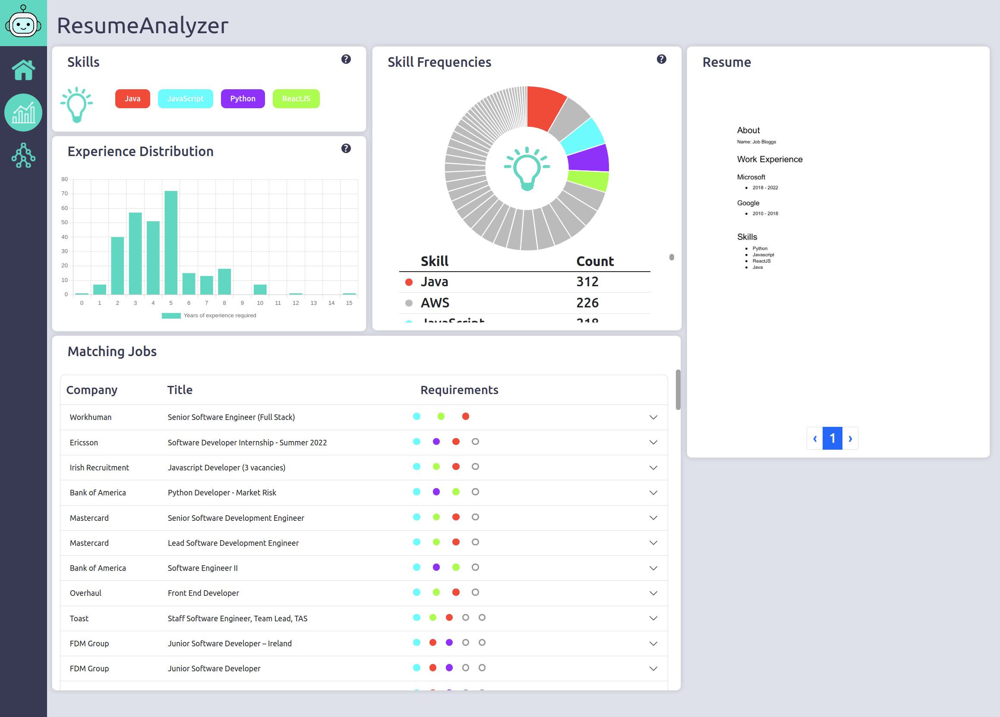

# ResumeAnalyzer

## About

ResumeAnalyzer is a DCU Computer Science 4th year project that was created by Darragh McGonigle and Stephen McAleese.

## Description

ResumeAnalyzer is an online web application that enables software engineers to upload and analyze their resumes and learn which skills are in-demand in the job market for software engineers in Ireland.

Both features are powered by information that was acquired by analyzing and extracting insights from thousands of job posts.

 

The resume analysis page (above) has the following features:
- **Overall resume score:** based on resume skills and length.
- **Skill frequencies panel:** shows the number of job posts matching each skill keyword.
- **Skill recommendations:** recommends skills similar to those found in the uploaded resume.
- **Matching jobs:** job posts that match the skills found in the resume.

The reports page shows information extracted from the collection of job posts to give an overview of the software engineering job market:
- **Years of experience distribution:** shows how many years of experience are typically required for roles in the tech industry.
- **Skill frequencies:** the number of job posts matching each skill keyword.
- **Job post locations:** shows which locations have the most job posts.
- **Soft skill frequencies:** shows the number of job posts that match each soft skill keyword.

The tree page contains a graph that shows several job roles in the tech industry. Clicking on each graph node shows a list of skills and job posts that match that role.

## Tech stack
- Frontend: ReactJS.
- Backend: FastAPI.
- Analysis: Python, NLTK, scikit-learn, Gensim.
- Database: PostgreSQL, SQLAlchemy.

## Note
This project was originally created in GitLab before being moved to GitHub. The original GitLab repository can be found here:
https://gitlab.computing.dcu.ie/mcgonid3/2022-ca400-mcgonid3-mcalees2.
