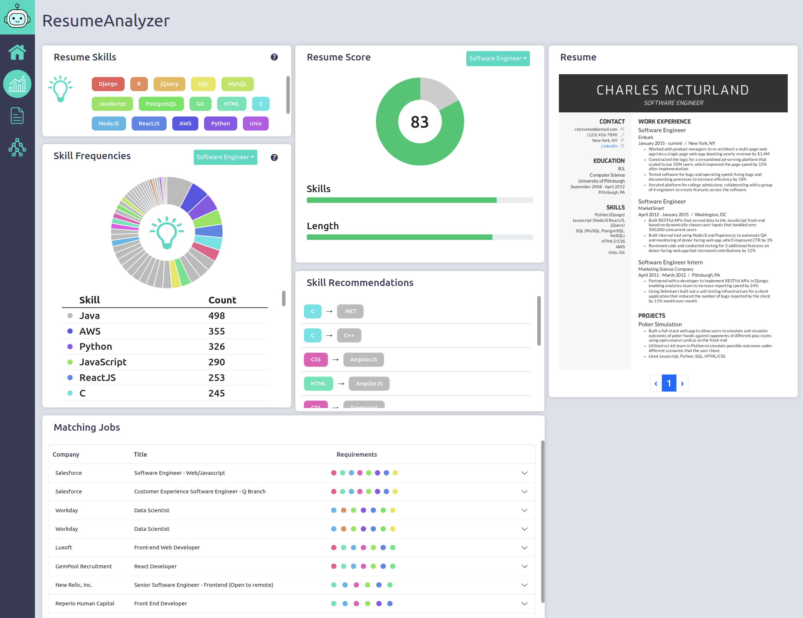

# Job Posting and Resume Analyzer

ResumeAnalyzer is a 4th year project that was created by Darragh McGonigle and Stephen 
McAleese and can be found running at https://resumeanalyzer.xyz.

The project is an online web application that allows software engineers to upload and analyze their resumes to learn more 
about how how valuable their skills are in the job market and how they could improve.

ResumeAnalyzer extracts insights from large numbers of job posts and uses these insights to analyze users' resumes.

 

 

## Additional resources

- Repo [hygiene](https://gitlab.computing.dcu.ie/sblott/local-gitlab-documentation/blob/master/repo-hygiene.md)
- Git [cheat sheet](https://gitlab.computing.dcu.ie/sblott/local-gitlab-documentation/blob/master/cheat-sheet.md)
- Gitlab [CI environment](https://gitlab.computing.dcu.ie/sblott/docker-ci-environment) and it's [available software](https://gitlab.computing.dcu.ie/sblott/docker-ci-environment/blob/master/Dockerfile)
- Example projects with CI configured:
   * [Python](https://gitlab.computing.dcu.ie/sblott/test-project-python)
   * [Java](https://gitlab.computing.dcu.ie/sblott/test-project-java)
   * [MySql](https://gitlab.computing.dcu.ie/sblott/test-project-mysql)
