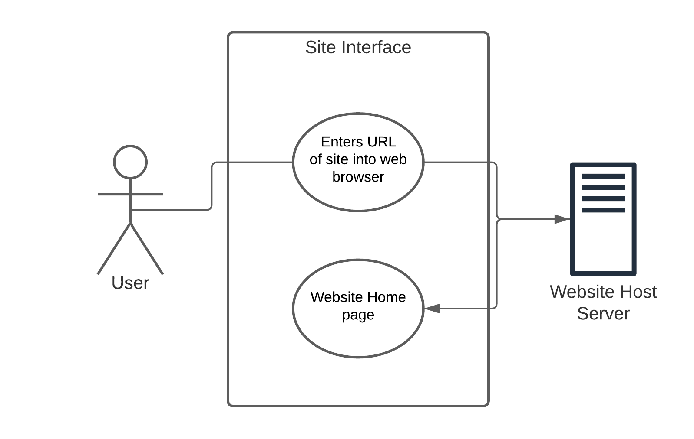
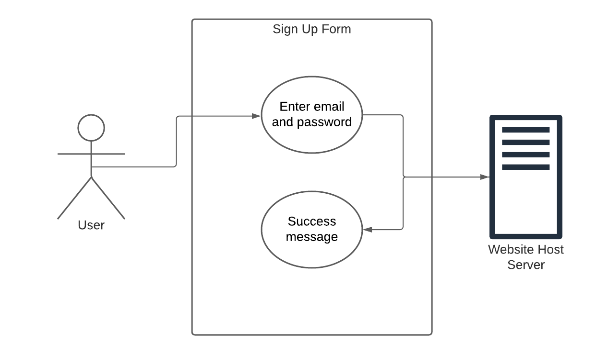
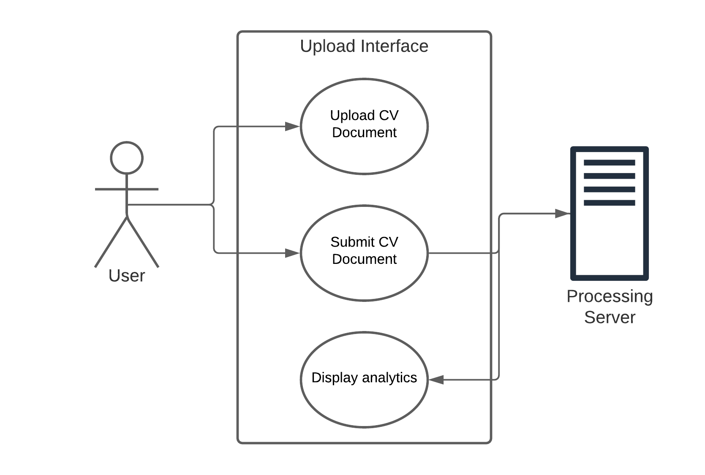
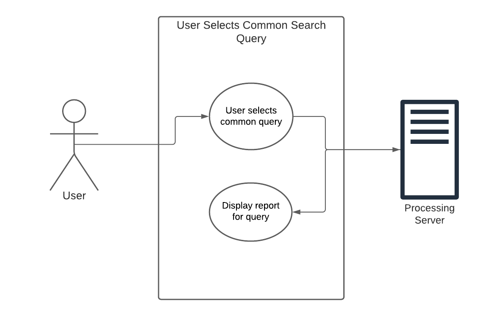
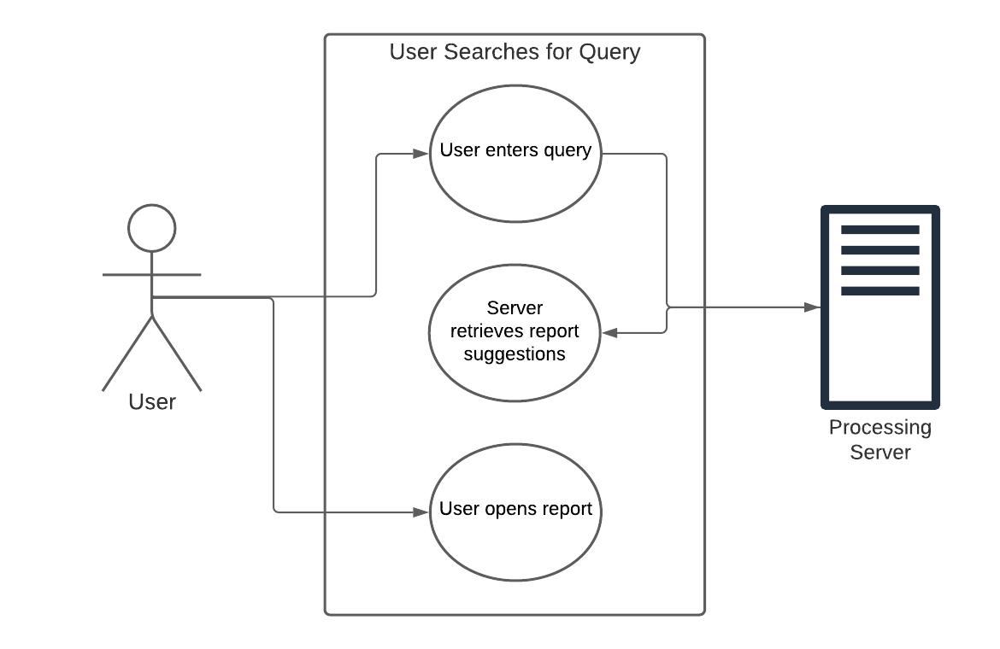
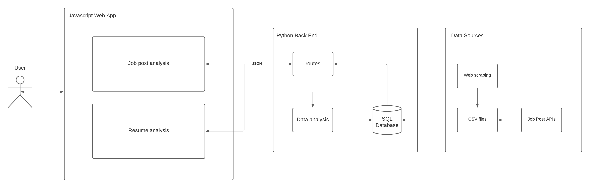
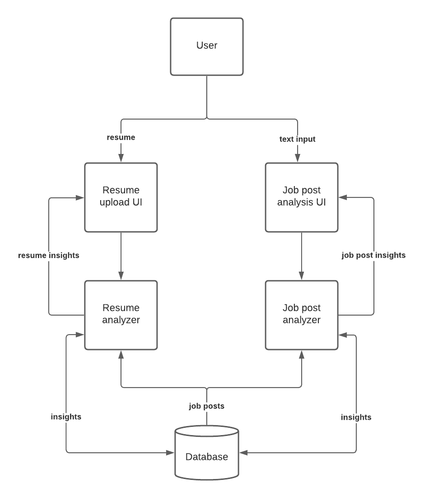
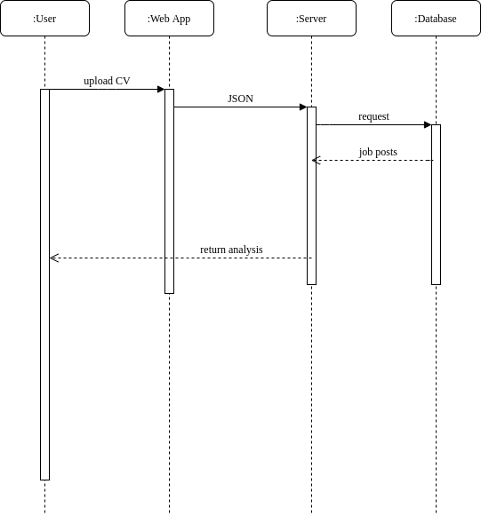
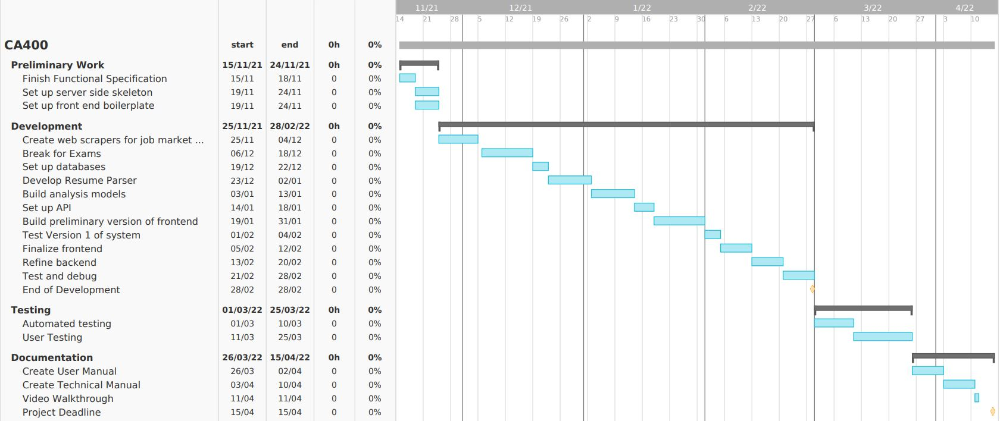

# 
 4th Year Project   Functional Specification 

# 
Project Name: Job Posting and Resume Analyzer 

## 
 Authors: Darragh McGonigle (18316121), Stephen McAleese (18921756) 

## 
 Supervisor: Michael Scriney 
 

\
\
 

# **0. Table Of Contents**

### **1. Introduction**
    1.1 Overview
    1.2 Glossary

### **2. General Description**
    2.1 Product Functions
    2.2 User Characteristics and Objectives
    2.3 Operational Scenarios
    2.4 Constraints

### **3. Functional Requirements**
    3.1 User Upload of CV
    3.2 Parsing a User Submitted CV
    3.3 Gathering Job Market Data
    3.4 Performing Data Analysis
### **4. System Architecture**

### **5. High-Level Design**

### **6. Preliminary Schedule**

### **7. Appendices**

\
 

# **1. Introduction**
## 1.1 Overview
Our 4th year project is a web application that will carry out natural language processing on CVs and job posts to provide useful services for job-seeking software engineers. The two primary services we intend to offer are the ability to analyze and evaluate CVs and suggest improvements to them and a tool for finding useful insights about the job market for software engineers. The system will use large numbers of job posts as the input data source for both services.

The CV analysis and evaluation feature will enable users to upload their CVs to a CV analyzer which will evaluate the quality of the CV and suggest improvements based on trends in the current job market which can be inferred from job posts. The system will carry out natural language processing (NLP) on each CV to extract key information such as skills, technologies, certifications and prior employment. This information will then be processed and compared to information about job market trends. For example, the system could compare the skills found on the resume with the most popular current technologies to suggest which skills the resume owner might want to learn to maximize their employability. In addition to skill and experience evaluations, we plan on evaluating the overall writing quality of the CVs.

We also plan to offer users the ability to find and view job market trends more directly. This feature will use user input along with large numbers of job posts to generate useful insights such as the skills that are most in demand, the highest-rated companies or the number of job postings for certain subskills or job categories. The goal is to synthesize insightful, valuable up-to-date reports from the data gathered in the job posts in advance and on-demand using user input.

The overall goal of our project is to create a web application that would inform users on current job market trends and provide a free service for evaluating and improving the CVs of users.

 

## 1.2 Glossary
The following table contains technical terms which will be used throughout the document. The definitions of these terms are in the context of this project.
| **Term**     | **Definition** |
|--------------|----------------|
| NLP          |  Natural Language Processing is a the process for applying various computing techniques in order to work with and process unstructured text. |
|API           |  Application Programming Interfaces enable communication between a system and another external system.             |
| React        | React is a modern Javascript library developed by Facebook. |
| Django       | Django is a Python library designed for developing APIs. |

\
 

# **2. General Description**
## 2.1 Product Functions
The product will be a web application with a resume upload page for resume analysis and a data analytics tool for viewing job market trends.

The CV upload tool will consist of a page where user can upload their CVs. After uploading, CVs will be sent to the system's back end service where they will be processed using machine learning and NLP to extract key terms and information about the user. This information might include certifications, skills, characteristics, technologies, employment history and other useful information. This information will then be analysed by the system which will make use of its collection of job market data (job listings, linkedin profiles, etc.) to analyse the user's provided information and evaluate how well their CV will fare in the current job market. The system will then return helpful information to the user such as the skills or certifications that will be most beneficial in progressing their career, potential career paths they could pursue (and what steps are needed) and other useful information to help the user improve their CV and make progress in their career. This information will be displayed to the user after their CV has been processed. The system should also allow the user to see jobs that they are most suited for given their current skill set.

The second major feature of our product is the job market insight tool which will use data mining and NLP techniques to extract information from job posts and display it to users in the form of reports. The goal is to give users the ability to type natural language questions into the system to generate reports on important topics such as company reviews, technologies and industry trends and information on salary trends. These reports could contain text extracts, tables or visualisations that show important and valuable information on a particular industry trend. Reports can be regularly updated automatically so that they are always up-to-date. As we expect many popular questions to be repeated, for performance reasons, reports can be stored in a database and retrieved instead of being re-generated every time a new search query is asked. When a search query is entered into the system, the system could offer existing reports that could be opened instantly by clicking on them or the option of creating a new report which would take longer but give the user the opportunity to do novel data analysis. For reports that need to be generated, as there is a trade off between speed and the depth of analysis, we plan on finding a good balance between these two goals.

 

## 2.2 User Characteristics and Objectives
This product is mainly intended for software engineers who are beginning their career path such as new graduates, young people aged 18 - 30 and engineers who are looking to make a career change. This user base will have a wide range of technical abilities and experience and as such the system will need to be accommodating to people of all levels of technical expertise. However we do expect our users to have a basic functional understanding of web applications and how to use them. We plan to initially offer the product to English speaking users and users who live in Ireland or are looking for job opportunities in Ireland.

From a user's perspective, accessing and using the system should be as straightforward as navigating to the URL using a modern web browser of their choice before uploading a CV or selecting or typing a search query. Unless the answer to the query has been pre-calculated, we expect that there  will be a short delay (No more than 30-40 seconds) as processing takes place before the screen changes to display the output information to the user. From here the user is free to navigate and explore the displayed information and interact with any interactive information displayed.

 

## 2.3 Operational Scenarios
 

### **User Accesses the Site**

**Description**

A user will open their web browser of choice. They will then type in the URL of the web application. Once complete the web browser will send a request to the web server which will respond with the home page of the application.

**Goal**

A user can access the website homepage using a web browser and an internet connection.

**Step-by-Step Interaction**

1. The user opens their web browser of choice.
    *  This can be any modern web browser. Edge, Chrome, Firefox, Safari, etc.
2. The user enters the web applications URL into the search/navigation bar.
3. The web applications home page will be displayed to the user in the browser.
    *   If the user is using a browser which does not support Javascript an error message will be displayed.
    *   If the browser fails to access the web application then it will display an appropriate error message.

 

### **User Signs Up**

**Description**

After opening the website, if the user does not yet have an account, they can enter their email and desired password to sign up and create a new account.

**Goal**

A user can create a new account on the website.

**Step-by-Step Interaction**

1. The user opens the website.
2. The user types in their email and password and a password confirmation.
    * If the passwords do not match, there is an error.
    * If the account already exists, the user is redirected to the login form.
3. A message is shown to the user saying that they have successfully created a new account.

 

### **User Logs In**

**Description**

Once the user has an account, it should be possible for a user to log in to their account.

**Goal**

A user can log in to their account on the website.

**Step-by-Step Interaction**

1. The user types in their email and password.
    * If the email does not exist, a message is displayed saying that the username has not been found.
    * If the email is found but the password is incorrect, an incorrect password message is shown.
2. If there are no errors, the user is logged into their account and a success message is shown.

 

### **User Uploads a CV**

**Description**

The user will be able to upload a CV that is stored on their computer in a PDF format. They will then press a button to submit this file and it will be uploaded to the server. After a brief processing time for the analysis, the user will be presented with the results of the analysis. 

**Goal**

A user can upload their CV as a file, have it analyzed and see the analysis results.

**Step-by-Step Interaction**

1. The user uploads the CV document file.
    *   This can either be done by dragging the file over the upload section on the website or by clicking a button which will open the user's file explorer where they can then select the file for upload.
2. User presses the "Submit" button.
3. The user waits as the page displays a loading icon while the document is processed and analyzed.
4. The user is shown a screen displaying the results of analysis the CV.

 

### **User Selects a Common Search Query**

**Description**

A common pre-computed search query is shown in a button. For example, a button could contain the text "Most popular programming languages in Ireland". Clicking the button causes a report for the query to be displayed.

**Goal**

A user can click a common search query and see the report associated with it.

**Step-by-Step Interaction**

1. The user clicks on a button containing a common search query.
2. The report for the query is displayed. The report contains text and visualisations which inform the user on the query topic.
3. The user closes the report and returns to the home screen.

 

### **User Searches for a Query**

**Description**

The user types in a search query with a question related to the current job market for software engineers in Ireland. A report that answers the query is generated or found and the user reads the report. The report contains descriptions and visualisations that answer the user's query or inform them on a topic.

**Goal**

To allow users to search for queries about the current job market for software engineers and gather useful information related to the query.

**Step-by-Step Interaction**

1. The user types in a search query such as "Top programming languages in Ireland".
2. The system interprets the meaning of the query and the type of information that should be retrieved.
3. The system returns pre-computed reports which are similar to the query or generates a new report that answers the query. In this example, the report "Most popular programming languages in Ireland" is similar to the question "Top programming languages in Ireland."
4. The user selects the report they would like to view and opens it.
5. The user closes the report after viewing it and returns to the home screen.

 

## 2.4 Constraints
Development of this system will have to abide by the following constraints:

* **Time constraints:** development and deployment of the project must be complete by April 2022.
* **Financial constraints:** the project will have little to no budget and thus will not be able to make use of any expensive services such as hosting or non-free development tools or subscriptions.
* **Processing constraints:** due to the aforementioned budget constraint the computing and storage capability of the server hardware will be limited.
* **Legal constraints:** the product will process user data and therefore must be in accordance with European and International regulations for data management, data storage and data protections.
* **Platform constraints:** the product is a web application and as such must be developed with modern browser capabilities in mind. These browsers will have different features and capabilities which the product must be able to adapt to for a consistent user experience.
* **Traffic constraints:** due to budget and processing limitations the system will not be able to handle large amounts of users accessing the product at once.

\
 

# **3. Functional Requirements**
## 3.1 User Upload of CVs
**Description**
* A user of the system must be able to upload a CV or resume to the system and submit it for processing. The file must be encrypted during transport and sent over a secure connection as it will contain users' personal information such as names and email addresses.

**Criticality**
* This feature is vital to the system as CVs are the system's only significant source of information about the user. Without this feature the system cannot get critical data needed for analysis such as skills, employment history and technical knowledge.

**Technical Issues**
* There are two main technical challenges for this feature, the first is decoding a user's file from its initial file type (eg. PDF) into a standardised file format which can be sent to the server such as JSON. The second challenge is to ensure that the information in the CV is kept secure when it is uploaded and transmitted to the server.

**Dependencies**
* This feature is dependent on the user having access to a web browser and an internet connection.

## 3.2 Parsing User-Submitted CVs
**Description**
* The system must be able to parse a user-submitted CV and identify and extract key data such as skills, technical knowledge, past employment, certifications, education and other important information. This will be carried out using machine learning-based natural language processing.

**Criticality**
* This feature is necessary as CVs will be the primary source of information about users and the data extracted from CVs will be essential for the analysis and evaluation of CVs.

**Technical Issues**
* The main technical issue faced with this feature will be related to natural language processing as it will be challenging to automatically extract information from unstructured text and categorise it.

**Dependencies**
* This feature is dependent on the CV upload feature as it must be possible to first upload a CV before it can be parsed.

## 3.3 Gathering Job Posts
**Description**
The system must be able to automatically scrape job posts from websites such as Indeed and LinkedIn and store them in a performant and well-structured database. It should be possible to do this relatively quickly as the job market changes over time and information can quickly become outdated.

**Criticality**
* This feature is very important as job posts will be the system's primary source of information about the job market which it will use to analyse the job market and provide valuable insights for users.

**Technical Issues**
* The main technical challenge is scraping information quickly and reliably from a wide variety of sources which is necessary as many data sources do not have APIs for accessing them. On top of this, storing and managing this data in a reliable and consistent way in databases will also be a significant technical challenge for this feature.

**Dependencies**
* This feature is not dependent on any other features within the system and will serve as a standalone tool which will in the background to gather and feed data into the rest of the system.

## 3.4 Data Analysis of Job Posts and CVs
**Description**
* The system should gather job posts and other sources of information about the job market as well as data extracted from the users' uploaded resume for data analysis to provide meaningful and useful insights to the user.

**Criticality**
* This feature is vital to the functionality of the application as without it the system would not be able to carry out any evaluations or extract valuable insights from data for the user.

**Technical Issues**
* The main technical challenge is developing the various models and algorithms needed for combining and interpreting the data to create meaningful and understandable information for the user.

**Dependencies**
* This feature is dependent on both the CV submission feature and the job post data gathering feature as these features will provide the necessary data for the analysis to take place.

## 3.5 Report Search and Generation
**Description**
The system should give users the ability to search for existing pre-generated reports which contain useful information about the job market and also to generate new data analysis reports based on user's search queries.

**Criticality**
This feature is necessary to make the insights gathered from job posts directly available to the user in the form of reports. The ability of users to supply input to the data analysis system is valuable as these inputs will guide the data analysis process and also inform the system on what kinds of information are most popular.

**Technical Issues**
The main technical challenge for this feature would be to extract the meaning of the user's query and find or generate reports relevant to it that contain information in a usable and readable format.

**Dependencies**
This feature is dependent on the job post gathering and data analysis phases as both of these features are required to generate analysis reports.

## 3.6 User Registery and Login
**Description**
The system should allow users to register and create an account on the system. The user will provide their email and desired password which will be encrypted and stored in a database. The user should then be able to authenticate themselves with the system using these credentials and access information related to their account. 

**Criticality**
This feature is not vital as the system could be built without storing information about users and require users to submit their CVs each time they visit the web application. It is however a convenient feature which would also allow users to track their progress.

**Technical Issues**
The main technical challenge will be creating and maintaining the database for user credentials as well as making sure that all data is kept secure in accordance with European and International data protection laws.

**Dependencies**
This feature has no dependencies on any other feature in the application.

\
 

# **4. System Architecture**

The system is composed of three primary high-level components: a user-facing front end web application that provides the user interface of the application, a back end web server that will perform data analysis on CVs, user input and job posts stored in the database and a data gathering application that gathers job posts using APIs and scraping scripts.

User input in the form of a CV upload or text input will be passed to the back end server as JSON. The back end service will then perform data analysis on these inputs and any other necessary information stored in the database before sending insights in the form of a JSON response to the front end application after a processing delay.

As job market trends and job posting patterns change over time, it is important to regularly update the database. This will be done by the data sources component consisting of APIs and scraping scripts which will update the database with fresh data at regular intervals.

 

\
 

# **5. High-Level Design**

The data flow diagram above shows the major components of the system how they interact with each other and the kind of inputs and outputs each component sends or receives. The top of the diagram shows the user who interacts with the web application which is composed of two major features: the resume or CV upload and insights page and the job postings insights page.

Users who choose to use the resume upload feature can upload their resumes for analysis. When a resume is uploaded, it is sent to the resume analyzer for processing. To analyze resumes, the resume analyzer will read job postings or pre-computed insights from the database and use them to extract useful insights from resumes. These insights are then sent back to the user and displayed by the user interface in an intuitive and useful report that makes use of a combination of text and visualisations to display insights.

The job posting analysis service is the other major component of the system. Users can use this service by clicking buttons representing popular search queries or they may do their own searches. This feature should handle user questions and respond to them with reports that contain information relevant to the question. To answer questions, we plan on using AI to recognize the type of question asked. For example, "best rated companies" and "best paying companies" are similar in that they involve the evaluation of companies and probably require the generation of a ranked list. Once the type of question has been identified, the contents of the search query can be used to infer the specific question that was asked. The AIs guess of the purpose of the question can be displayed to the user who can accept the AIs response or try again. Accepted queries can then be used to retrieve or generate reports.

## CV Upload Sequence Diagram

 

The sequence diagram above shows the sequence of operations that need to be completed for a user to successfully upload and view the analysis of their CV. The diagram shows the interactions between system components during the upload, analysis and viewing steps. First the user uploads their CV to the web app before it is sent to the server as JSON. The back end server uses information from the database to carry out analysis on the CV and sends the resulting analysis back to the front end application as JSON data. The front end application can then display this data to the user in the form of a readable and insightful report.

\
 

# **6. Preliminary Schedule**

The initial development plan for the project is as follows. We will begin by setting up the skeletons for the front and back end of the system. In this step we will generate any boiler plate code for technologies that we will be using such as React and Django. We are aiming to complete this first step by late November which will give us time to briefly start development before the DCU exam period.

Starting in late November we plan to start building the scrapers and API interfaces which will be used to gather and aggregate data about the job market from sources such as  LinkedIn and Indeed. We plan to get this data gathering step done before the exams but expect that there might be the risk of some overrun as exams draw near. 

Following the DCU exams in December we hope to get our database set up so that the data gathering system can store the data for use by later systems. Also starting in mid December will be the development and training work for the natural language processing engine which will be used to parse users' CVs. Development on this feature is expected to run though to the start of January. With the completion of the NLP parser and the data gathering feature we should have all the data we need to begin work on the analysis engine which would take us until mid January.

When the analysis engine is completed all that is left for the back end of the system will be setting up the API endpoints so that these features can be accessed from our frontend web app. Then up until early February we plan to develop and improve the front end of the application. With both a front end and back end complete we plan to spend the beginning of February carrying out end-to-end testing on the system to identify any bugs. Once the first round of testing is complete we will spend 2 weeks finalising and polishing the product. This will be followed by a final round of testing and debugging which will finish in late February.

With development wrapped up we will carry out the necessary automated and user testing to ensure the system is sound. We will then spend the last 2 weeks focusing on the documentation for the system. All deliverables should be finished several days before the deadline on April 15th.

\
 

# **7. Appendices**

Natural Language Processing: https://www.ibm.com/cloud/learn/natural-language-processing

Web Scraping: https://en.wikipedia.org/wiki/Web_scraping

React Official Website: https://reactjs.org/

Django Official Website: https://www.djangoproject.com/

Indeed job listing website: https://ie.indeed.com/?r=us

LinkedIn: https://ie.linkedin.com/